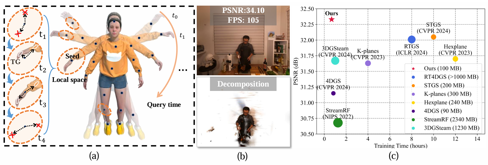
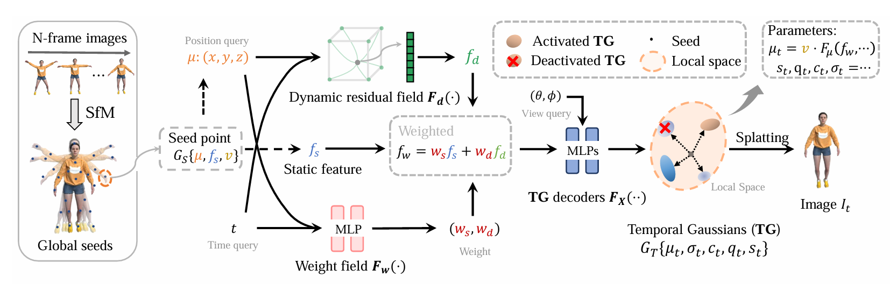

# LocalDyGS
### [Project page](https://wujh2001.github.io/LocalDyGS/) | [Paper](https://arxiv.org/pdf/2507.02363) | [VRU Dataset](https://huggingface.co/datasets/BestWJH/VRU_Basketball/tree/main)
> **LocalDyGS : Multi-view Global Dynamic Scene Modeling through Adaptive Local Feature Decoupling**,            
> Jiahao Wu, Rui Peng, Jianbo Jiao, Jiayu Yang, Luyang Tang, Kaiqiang Xiong, Jie Liang, Jinbo Yan, Runling Liu, Ronggang Wang  
> **Peking University, Pengcheng Lab, University of Birmingham**  
> **ICCV 2025**
> 
This repository is the official implementation of **"LocalDyGS : Multi-view Global Dynamic Scene Modeling through Adaptive Local Feature Decoupling"**. 
In this paper, we propose a method that is capable of modeling not only fine-scale motion but also large-scale motion effectively.




## 1. Environmental Setups

We tested on a server configured with Ubuntu 20.04, cuda 11.8 and gcc 11.4.0. Other similar configurations should also work, but we have not verified each one individually.  In fact, this environment configuration is not strict — any environment that can run 3DGS properly should also be able to run our program. In addition, some extra packages are required, such as Tinycudann.


1. Clone this repo:

```bash
git clone https://github.com/WuJH2001/LocalDyGS.git --recursive
cd LocalDyGS
```

2. Install dependencies

```bash
conda activate LocalDyGS
conda env create --file environment.yml
```

After that, you need to install [tiny-cuda-nn (1.7)](https://github.com/NVlabs/tiny-cuda-nn). 


## 2. Data Preparation

### 2.1. For N3DV dynamic scenes:

[Plenoptic Dataset](https://github.com/facebookresearch/Neural_3D_Video) could be downloaded from their official websites. To save the memory, you should extract the frames of each video and then organize your dataset as follows. As same as 4DGS.

```
├── data
│   | dynerf
│     ├── cook_spinach
│       ├── cam00
│           ├── images
│               ├── 0000.png
│               ├── 0001.png
│               ├── 0002.png
│               ├── ...
│       ├── cam01
│           ├── images
│               ├── 0000.png
│               ├── 0001.png
│               ├── ...
│     ├── cut_roasted_beef
|     ├── ...
```

For training dynerf scenes such as `cut_roasted_beef`, run this command to obtain the initial point clouds.
```python
bash colmap.sh Your/Path/To/cut_roasted_beef llff
```

### 2.2. For other multi-view dynamic scenes (e.g., MeetRoom, VRU dataset):

Please follow the step-by-step instructions in [this script](scripts/multiview_data_process) to process your data.  The processed camera poses for MeetRoom are available [here](https://1drv.ms/f/c/80737028a7921b70/EneGBEJSEEdFtnisrn8rP40BYMxn0sSR8m7fsgRoahCAhg?e=C7SVar). 
If you use the camera parameters we provided, you can skip steps 1 and 2 and go directly to step 3.

The dataset will end-up like this ( As same as 3DGStream):

```
<scene>
|---frame000000
|---frame000001
|   |---sparse
|   |   |---...
|   |---<image 0>
|   |---<image 1>
|   |---...
|---frame000002  
|---frame000299
|---distorted
|   |---...
|---...      
```

In this part, there are still some additional data processing tasks to be done, and the data processing code will be open-sourced.


## Training

For training dynerf scenes such as `cut_roasted_beef`, run
```python
python train.py -s Your/Path/To/cut_roasted_beef   -m  output/dynerf_test/cut_roasted_beef   --configs arguments/dynerf/cut_roasted_beef.py 
```

For training dynerf scenes such as `VRU basketball`, run
```
python train.py -s Your/Path/To/basketball_gz -m output/VRU/basketball_gz_0_20 --frames_start_end 0 20  --configs  arguments/vrugz/basketball.py 
```


The training difference between N3DV and VRU lies in the number of frames. N3DV trains 300 frames at once due to small motions, while VRU, with large-scale motion, trains 20 frames at a time. For the 250-frame VRU dataset, we set `--frames_start_end 0 20` and divide it into multiple clips: 0–20, 20–40, 40–60, etc.


## Rendering

Run the following script to render the images.

```
python render.py --model_path output/dynerf/cut_roasted_beef --skip_train --skip_video --iteration 30000 --configs  arguments/dynerf/cut_roasted_beef.py
```
or
```bash 
python render.py  --model_path  output/VRU/basketball_gz_0_20 --frames_start_end 0 20 --skip_train --skip_video --iteration 30000 --configs arguments/vrugz/basketball.py
```

## Evaluation

You can just run the following script to evaluate the model.

```
python metrics.py --model_path output/dynerf/cut_roasted_beef/
```


## Contributions

**This project is still under development. Please feel free to raise issues or submit pull requests to contribute to our codebase. Thanks to previous excellent works.** If you find our repository helpful, we would be very happy if you could give us a star.


## Citation

```
@article{wu2025localdygs,
  title={LocalDyGS: Multi-view Global Dynamic Scene Modeling via Adaptive Local Implicit Feature Decoupling},
  author={Wu, Jiahao and Peng, Rui and Jiao, Jianbo and Yang, Jiayu and Tang, Luyang and Xiong, Kaiqiang and Liang, Jie and Yan, Jinbo and Liu, Runling and Wang, Ronggang},
  journal={arXiv preprint arXiv:2507.02363},
  year={2025}
}
```
